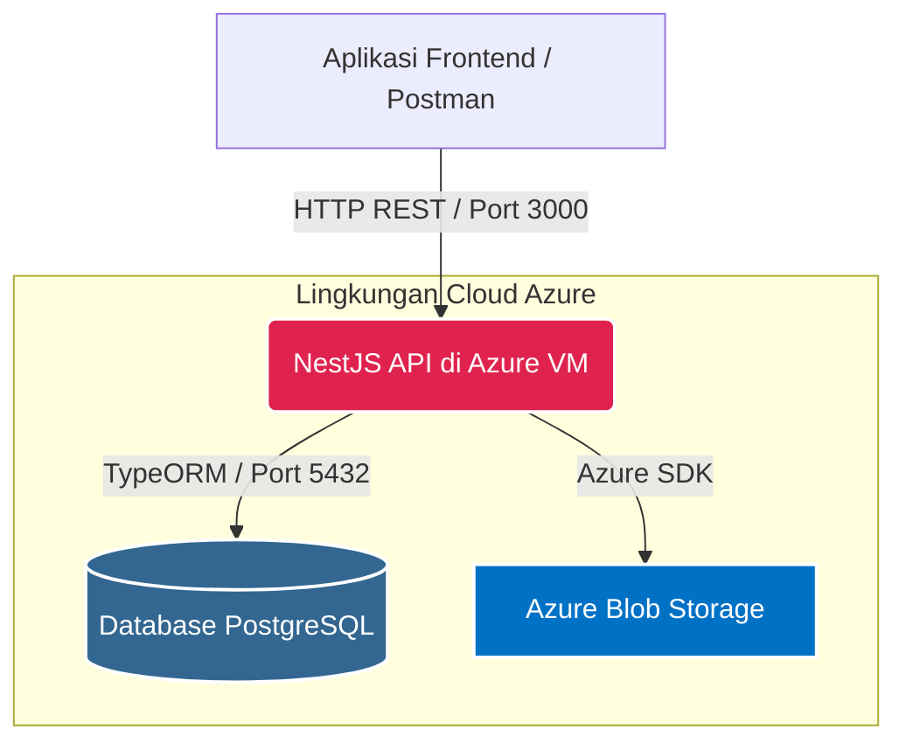
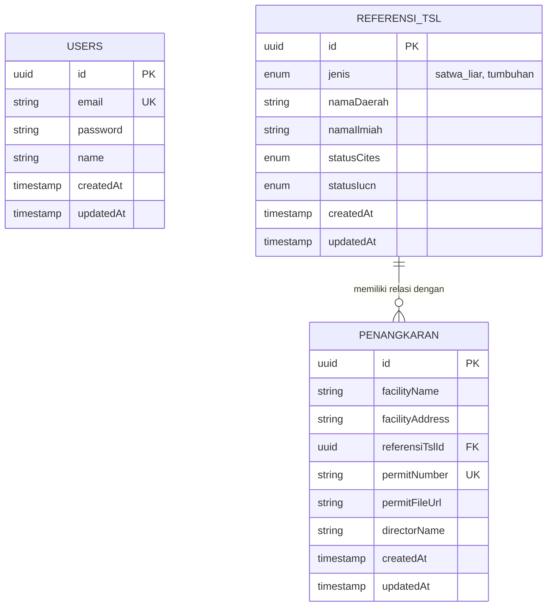

# Idaman Backend API - Technical Test


Repositori ini berisi REST API Backend yang dibangun secara profesional menggunakan **NestJS**, **TypeScript**, dan **PostgreSQL**.

---

## Pencapaian Fitur (Poin Technical Test)

- **Sistem Autentikasi (JWT):** Implementasi registrasi dan login yang aman. Rute API dilindungi dengan ketat menggunakan `JwtAuthGuard`.
- **Manajemen Data Relasional:** Operasi CRUD lengkap untuk entitas `User`, `ReferensiTsl` (Taksonomi), dan `Penangkaran`, dengan validasi Foreign Key yang ketat.
- **Penyimpanan Cloud (Azure Blob):** Integrasi langsung dengan **Azure Blob Storage** via `@nestjs/platform-express` (`FileInterceptor`) untuk menangani unggahan dokumen izin (`multipart/form-data`).
- **Penanganan Error:** Penanganan error tingkat lanjut yang menangkap pelanggaran constraint PostgreSQL (misal: `23503` Foreign Key, `23505` Unique) dan mengubahnya menjadi pesan HTTP 400/409 yang mudah dipahami klien.
- **Pengujian Otomatis :** Unit Test berhasil 100% menggunakan Jest Mock Providers, serta End-to-End (E2E) Test spesifik yang berfokus pada siklus hidup Token API.
- **Dokumentasi API Terstruktur:** [Lihat Dokumentasi API Lengkap di Postman](https://documenter.getpostman.com/view/51010779/2sBXwsLqEi)

---

## Arsitektur Sistem

Aplikasi ini menggunakan arsitektur cloud-native modern yang di-hosting sepenuhnya di ekosistem Microsoft Azure.



---

## Entity Relationship Diagram (ERD)


---

## Pola Desain (Design Patterns)

NestJS secara native mewajibkan penerapan pola desain Software Engineering yang baik. Berikut adalah pola utama yang digunakan:

1. **Dependency Injection (DI) Pattern**
   - **Alasan**: Memisahkan pembuatan objek dari penggunaannya. Modul seperti `AzureStorageService` atau `UsersRepository` disuntikkan melalui konstruktor, memudahkan pengujian (mocking) dan modularitas.
2. **Repository Pattern**
   - **Alasan**: Mengabstraksi lapisan data. Logika bisnis hanya berinteraksi dengan antarmuka generik `Repository<Entity>` dari TypeORM, memisahkan logika SQL murni dari aturan aplikasi.
3. **Decorator Pattern**
   - **Alasan**: Digunakan secara ekstensif (seperti `@Controller()`, `@UseGuards()`) untuk menambahkan behavior dan pengecekan keamanan secara dinamis tanpa merusak kode inti.
4. **Data Transfer Object (DTO) Pattern**
   - **Alasan**: Memaksa validasi payload yang ketat (`class-validator`) di gerbang masuk sebelum data menyentuh lapisan controller.

---

## Panduan Instalasi & Menjalankan Aplikasi

### Prasyarat
Pastikan laptop Anda telah terpasang **Node.js 20+**. Anda tidak perlu memasang database lokal karena aplikasi akan langsung menembak ke server Azure.

### Pengaturan Environment (.env)
Untuk alasan keamanan, file `.env` tidak disertakan di dalam repositori publik ini. Silakan unduh file rahasia tersebut yang telah dikunci melalui tautan Google Drive berikut, lalu letakkan di dalam folder proyek ini:

**[Tautan .env](https://drive.google.com/file/d/1cNlWGBlEvMRXP6xTo33FULgXwZAcx5nc/view?usp=sharing)**

> **Catatan:** Kata sandi (password) untuk mengekstrak file ZIP ini dapat ditemukan pada lampiran video demonstrasi di menit ke-

### Instalasi & Eksekusi

```bash
# 1. Instal semua dependensi
npm install

# 2. Jalankan API di lingkungan pengembangan (Development)
npm run start:dev

# 3. Jalankan pengujian otomatis (Unit Test & E2E)
npm run test
npm run test:e2e
```
