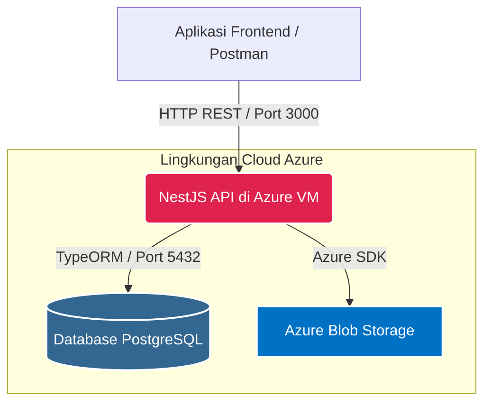
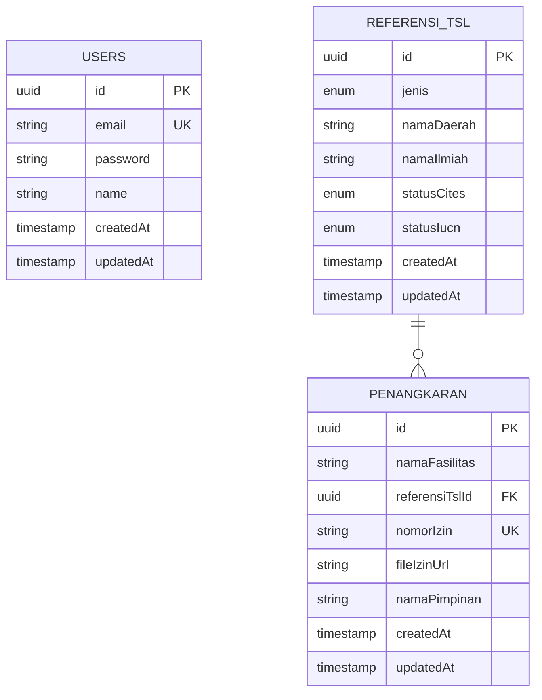

# Idaman Backend API - Technical Test


Repositori ini berisi REST API Backend yang dibangun secara profesional menggunakan **NestJS**, **TypeScript**, dan **PostgreSQL**.

---

## Spesifikasi Sistem

- **Sistem Autentikasi (JWT):** Implementasi registrasi dan login yang aman. Rute API dilindungi dengan ketat menggunakan `JwtAuthGuard`.
- **Database SQL:** Sistem menggunakan PostgreSQL sebagai database SQL untuk menyimpan data relasional.
- **Manajemen Data Relasional:** Operasi CRUD lengkap diterapkan pada entitas `ReferensiTsl` dan `Penangkaran` yang saling berelasi melalui *Foreign Key*, di mana data Penangkaran wajib merujuk pada data taksonomi yang valid pada ReferensiTsl.
- **Penyimpanan Cloud (Azure Blob):** Integrasi langsung dengan **Azure Blob Storage** via `@nestjs/platform-express` (`FileInterceptor`) untuk menangani unggahan dokumen izin (`multipart/form-data`).
- **Penanganan Error:** Penanganan error tingkat lanjut yang menangkap pelanggaran constraint PostgreSQL (misal: `23503` Foreign Key, `23505` Unique) dan mengubahnya menjadi pesan HTTP 400/409 yang mudah dipahami klien.
- **Pengujian Otomatis:** Unit Test berhasil 100% menggunakan Jest Mock Providers, serta End-to-End (E2E) Test berfokus pada siklus hidup JWT Token, mulai dari login untuk mendapatkan token, akses endpoint protected menggunakan token valid, hingga validasi penolakan akses tanpa token atau dengan token tidak valid.
- **Dokumentasi API Terstruktur:** [Lihat Dokumentasi API Lengkap di Postman](https://documenter.getpostman.com/view/51010779/2sBXwsLqEi)

---

## Pattern Project & Design Patterns

Project ini menggunakan pendekatan **Modular Architecture** khas NestJS, dengan pemisahan tanggung jawab ke dalam module, controller, service, repository, dan DTO. Pattern ini dipilih agar struktur kode lebih mudah dipelihara, diuji, dan dikembangkan secara terpisah berdasarkan fitur.

Beberapa design pattern utama yang digunakan dalam project ini adalah:

1. **Dependency Injection (DI) Pattern**
   - **Alasan**: Memisahkan pembuatan objek dari penggunaannya. Modul seperti `AzureStorageService` atau `UsersRepository` disuntikkan melalui konstruktor, memudahkan pengujian (mocking) dan modularitas.
2. **Repository Pattern**
   - **Alasan**: Mengabstraksi lapisan data. Logika bisnis hanya berinteraksi dengan antarmuka generik `Repository<Entity>` dari TypeORM, memisahkan logika SQL murni dari aturan aplikasi.
3. **Decorator Pattern**
   - **Alasan**: Digunakan secara ekstensif (seperti `@Controller()`, `@UseGuards()`) untuk menambahkan behavior dan pengecekan keamanan secara dinamis tanpa merusak kode inti.
4. **Data Transfer Object (DTO) Pattern**
   - **Alasan**: Menerapkan validasi payload yang ketat menggunakan `class-validator` sebelum data diproses oleh controller atau service.

---

## Arsitektur Sistem

Aplikasi ini menggunakan arsitektur cloud-native modern yang di-hosting sepenuhnya di ekosistem Microsoft Azure.



---

## Entity Relationship Diagram (ERD)



---

## Dokumentasi API

Dokumentasi lengkap endpoint API dapat diakses melalui Postman:

[Lihat Dokumentasi API Lengkap di Postman](https://documenter.getpostman.com/view/51010779/2sBXwsLqEi)

---

## Panduan Instalasi & Menjalankan Aplikasi

### Prasyarat
Pastikan laptop Anda telah terpasang **Node.js 20+**. Anda tidak perlu memasang database lokal karena aplikasi dikonfigurasi untuk terhubung langsung ke database PostgreSQL pada server Azure.

### Pengaturan Environment (.env)

Untuk alasan keamanan, file `.env` tidak disertakan di dalam repository publik. Gunakan file `.env.example` sebagai acuan konfigurasi environment variable yang dibutuhkan.

Contoh konfigurasi:

```env
DATABASE_HOST=
DATABASE_PORT=
DATABASE_USERNAME=
DATABASE_PASSWORD=
DATABASE_NAME=
JWT_SECRET=
AZURE_STORAGE_CONNECTION_STRING=
AZURE_CONTAINER_NAME=
```
Setelah konfigurasi diisi, simpan file tersebut sebagai `.env` di root folder project.


### Instalasi & Eksekusi

```bash
# 1. Instal semua dependensi
npm install

# 2. Jalankan API di lingkungan pengembangan (Development)
npm run start:dev

# 3. Jalankan pengujian otomatis (Unit Test & E2E)
npm run test
npm run test:e2e
```
